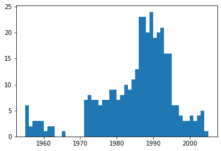
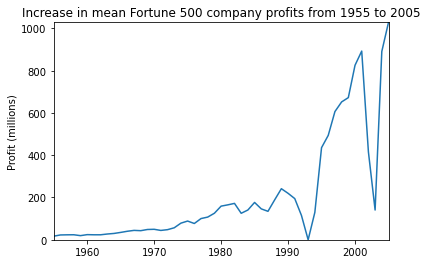
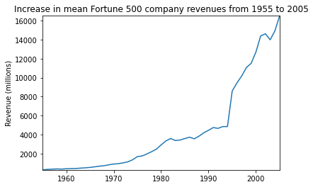
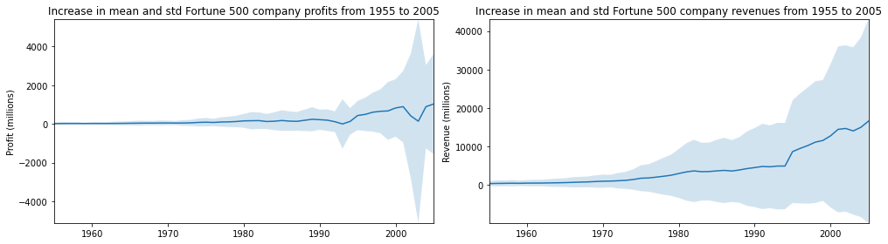

# 1、打开Jupyter Notebook
打开本地anaconda的Jupyter Notebook


# 2、创建并在Notebook内编写代码

## 1、新建一个Notebook Python 3 (ipykernel)，生成了一个Untitled.ipynb文件。
我们可以在这个文件里编写代码和编写markdown笔记


## 2、进行简单的python例子
1、自定义代码进行测试观察IN[]
2、编写快速排序算法

## 3、进行机器学习的模拟
1、下载数据集

2、将数据集上传到jupyter


3、编写代码进行测试
4、测试结果如下：


%matplotlib inline
import pandas as pd
import matplotlib.pyplot as plt
import seaborn as sns

df = pd.read_csv('fortune500.csv')

df.head()

df.tail()

df.columns = ['year', 'rank', 'company', 'revenue', 'profit']

len(df)
df.dtypes

non_numberic_profits = df.profit.str.contains('[^0-9.-]')
df.loc[non_numberic_profits].head()

len(df.profit[non_numberic_profits])

bin_sizes, _, _ = plt.hist(df.year[non_numberic_profits], bins=range(1955, 2006))

len(df)

df.dtypes


```python
%matplotlib inline
import pandas as pd
import matplotlib.pyplot as plt
import seaborn as sns

df = pd.read_csv('fortune500.csv')

df.head()

df.tail()

df.columns = ['year', 'rank', 'company', 'revenue', 'profit']

len(df)
df.dtypes

non_numberic_profits = df.profit.str.contains('[^0-9.-]')
df.loc[non_numberic_profits].head()

len(df.profit[non_numberic_profits])

bin_sizes, _, _ = plt.hist(df.year[non_numberic_profits], bins=range(1955, 2006))

len(df)

df.dtypes

```


    year         int64
    rank         int64
    company     object
    revenue    float64
    profit      object
    dtype: object


    

    


```python
%matplotlib inline
# %pylab
import pandas as pd
import matplotlib.pyplot as plt
import seaborn as sns

df = pd.read_csv('fortune500.csv')

df.head()

df.tail()

df.columns = ['year', 'rank', 'company', 'revenue', 'profit']

len(df)

df.dtypes

non_numberic_profits = df.profit.str.contains('[^0-9.-]')
df.loc[non_numberic_profits].head()

len(df.profit[non_numberic_profits])

bin_sizes, _, _ = plt.hist(df.year[non_numberic_profits], bins=range(1955, 2006))

df = df.loc[~non_numberic_profits]
df.profit = df.profit.apply(pd.to_numeric)
len(df)

df.dtypes


group_by_year = df.loc[:, ['year', 'revenue', 'profit']].groupby('year')
avgs = group_by_year.mean()
x = avgs.index
y1 = avgs.profit
def plot(x, y, ax, title, y_label):
    ax.set_title(title)
    ax.set_ylabel(y_label)
    ax.plot(x, y)
    ax.margins(x=0, y=0)

fig, ax = plt.subplots()
plot(x, y1, ax, 'Increase in mean Fortune 500 company profits from 1955 to 2005', 'Profit (millions)')

y2 = avgs.revenue
fig, ax = plt.subplots()
plot(x, y2, ax, 'Increase in mean Fortune 500 company revenues from 1955 to 2005', 'Revenue (millions)')

def plot_with_std(x, y, stds, ax, title, y_label):
    ax.fill_between(x, y - stds, y + stds, alpha=0.2)
    plot(x, y, ax, title, y_label)
fig, (ax1, ax2) = plt.subplots(ncols=2)
title = 'Increase in mean and std Fortune 500 company %s from 1955 to 2005'
stds1 = group_by_year.std().profit.values
stds2 = group_by_year.std().revenue.values
plot_with_std(x, y1.values, stds1, ax1, title % 'profits', 'Profit (millions)')
plot_with_std(x, y2.values, stds2, ax2, title % 'revenues', 'Revenue (millions)')
fig.set_size_inches(14, 4)
fig.tight_layout()


```


    

    


    

    


    

    


    

    


```python
import numpy as np
def square(x):
    return x * x
x = np.random.randint(1, 10)
y = square(x)
print('%d squared is %d' % (x, y))

```


```python
def partition(arr,low,high): 
    i = ( low-1 )         # 最小元素索引
    pivot = arr[high]     
  
    for j in range(low , high): 
  
        # 当前元素小于或等于 pivot 
        if   arr[j] <= pivot: 
          
            i = i+1 
            arr[i],arr[j] = arr[j],arr[i] 
  
    arr[i+1],arr[high] = arr[high],arr[i+1] 
    return ( i+1 ) 

#快速选择排序
def quickSort(arr,low,high): 
    if low < high: 
  
        pi = partition(arr,low,high) 
  
        quickSort(arr, low, pi-1) 
        quickSort(arr, pi+1, high) 
  
arr = [10, 7, 8, 9, 1, 5] 
n = len(arr) 
quickSort(arr,0,n-1) 
print ("排序后的数组:") 
for i in range(n): 
    print ("%d" %arr[i])
```

    排序后的数组:
    1
    5
    7
    8
    9
    10
    


```python
import time
time.sleep(3)
```


```python
print('hello world!')
```

    hello world!
    
